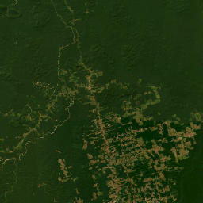
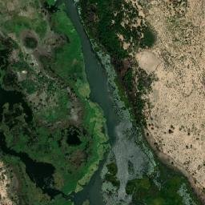
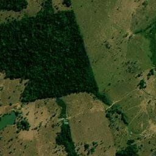

# Group_I
ADPRO Group Project

## Team

| Name               | Student Number | Email                  |
|--------------------|----------------|------------------------|
| Guilherme Morgado  | 56857          | 56857@novasbe.pt       |
| Isaac Carvalho     | 57045          | 57045@novasbe.pt       |
| Matilde Ferreira   | 56599          | 56599@novasbe.pt       |
| Miguel Teixeira    | 56529          | 56529@novasbe.pt       |

---

## Project Structure

```text
Group_I/
├── app/                   # Main application modules
│   ├── data_loader.py     # Downloads datasets (Function 1)
│   ├── data_manager.py    # OkavangoData class — orchestrates data
│   ├── image_loader.py    # Fetches satellite images from ESRI
│   ├── merger.py          # Merges geodata (Function 2)
│   ├── ollama_pipeline.py # AI analysis pipeline (vision + text)
│   └── storage.py         # Cache check before re-running pipeline
├── database/
│   └── images.csv         # History of AI analysis runs
├── downloads/             # Downloaded datasets (auto-generated)
├── images/                # Cached satellite tiles (auto-generated)
├── notebooks/             # Prototyping notebooks
├── pages/                 # Streamlit multipage app
│   ├── 2_AI_Workflow.py   # Page 2 — AI environmental risk analysis
│   └── 3_History.py       # Page 3 — Analysis history log
├── tests/                 # pytest test suite
│   ├── test_data_loader.py
│   └── test_merger.py
├── .streamlit/
│   └── config.toml        # Forced light theme for consistency
├── models.yaml            # AI model configuration (prompts, params)
├── main.py                # App entry point
└── requirements.txt
```

---

## About the Project

This tool analyses environmental data from [Our World in Data](https://ourworldindata.org) and combines it with AI-powered satellite image analysis to assess environmental risk across the globe.

The **main dashboard** (Page 1) displays interactive choropleth maps of five environmental indicators — annual change in forest area, annual deforestation, share of protected land, share of degraded land, and share of forest-covered land — alongside statistical summaries and top/bottom country rankings.

The **AI Workflow** (Page 2) allows users to select any geographical coordinates and zoom level to download a satellite image from ESRI World Imagery. The image is then analysed by a local vision model (LLaVA via Ollama) that produces a natural-language description, followed by a text model (Mistral via Ollama) that assesses whether the area is at environmental risk. Results are stored in a local CSV database, and repeated queries for the same coordinates are served from cache to save compute.

The **History** page (Page 3) displays a full log of all past analyses with filtering, sorting, a colour-coded world map, and detailed per-record views.

---

## How to Run the App

### 1. Clone the repository

```bash
git clone https://github.com/Miguel-teixeira04/Group_I.git
cd Group_I
```

### 2. Install dependencies

```bash
pip install -r requirements.txt
```

### 3. Install Ollama (required for AI Workflow)

Download and install [Ollama](https://ollama.com/) for your operating system. The app will automatically pull the required models (`llava:7b` and `mistral:7b`) on first use if they are not already available.

### 4. Launch the Streamlit app

```bash
python main.py
```

On first launch, the app will automatically download all required datasets into the `downloads/` directory. This may take a moment depending on your internet connection.

### 5. Running Tests

```bash
pytest
```

---

## Examples of Environmental Risk Detection

Below are three examples where the AI pipeline successfully identified areas at environmental risk.

---

### Example 1 — Amazon Region, Brazil (S 6.00°, W 55.00°, Zoom 8)



**Environmental Risk Detected**

**Image Description (AI):** The image shows a satellite view of a landscape with shades of green indicating vegetation and brown representing bare ground. Deforestation is visible in the form of large cleared areas where vegetation has been removed, creating a stark contrast between surrounding greenery and bare earth. Roads and pathways cut through the vegetation, and urban areas with denser concentrations of buildings are visible.

**Model Justification:** Deforestation is visible in multiple areas, indicating potential loss of habitat for wildlife and increased soil erosion. Urban sprawl also suggests human encroachment on natural habitats.

---

### Example 2 — Sahel Region, Africa (N 13.50°, E 14.00°, Zoom 15)



**Environmental Risk Detected**

**Image Description (AI):** The image shows a mix of water bodies, vegetation, and urban development. There are areas where the vegetation appears to have been cleared or burned, indicated by brown patches amidst the greenery. Urban areas are scattered throughout, with roads and buildings visible near water bodies.

**Model Justification:** Although there is no clear evidence of deforestation, the brown patches amidst the green suggest potential clearing or burning of vegetation. The presence of urban development near water bodies indicates possible impacts on biodiversity and water pollution. The balance between natural and human-made environments suggests ongoing environmental change due to human activity.

---

### Example 3 — Rondônia, Brazil (S 11.00°, W 62.00°, Zoom 15)



**Environmental Risk Detected**

**Image Description (AI):** The image shows a satellite view with a central forested area with healthy tree cover, but to the right there is a clear boundary where land cover changes to a more open landscape with patterns of agricultural fields or pastures. In the lower left corner, a small body of water is surrounded by cleared land, showing a patchwork of different land cover types including areas with no vegetation at all, suggesting recent clearing.

**Model Justification:** The image shows signs of deforestation in the lower left corner and agricultural expansion towards the right side, indicating potential loss of biodiversity. The patchwork of different land cover types suggests recent clearing. The presence of cleared land around the water body indicates possible urban sprawl or development.

---

## UN Sustainable Development Goals

This project directly contributes to several of the [United Nations Sustainable Development Goals](https://sdgs.un.org/goals):

The most direct connection is to **SDG 15 — Life on Land**, which calls for the protection, restoration, and sustainable use of terrestrial ecosystems. Our tool monitors deforestation, land degradation, and the share of protected land across the globe using the most recent data available. By combining these datasets with AI-powered satellite image analysis, the app enables users to identify at-risk regions in near real time, providing a practical instrument for conservation efforts. This directly supports Target 15.1 (conservation of terrestrial ecosystems), Target 15.2 (sustainable management of forests), and Target 15.3 (combating desertification and restoring degraded land).

The project also contributes to **SDG 13 — Climate Action**. Forests are critical carbon sinks, and their destruction accelerates climate change. By tracking annual changes in forest area and flagging areas of deforestation, our tool helps raise awareness of one of the key drivers of global warming. Early identification of deforested zones can support policymakers and environmental organisations in taking timely corrective action.

Additionally, the project is closely linked to **SDG 6 — Clean Water and Sanitation**. Deforestation and land degradation have a direct impact on water quality and availability. Forests play a critical role in regulating water cycles, filtering rainwater, and preventing soil erosion that leads to river and lake contamination. By monitoring land degradation and deforestation across the globe, our tool helps identify regions where water resources may be under threat, supporting early intervention before irreversible damage occurs.

Finally, **SDG 14 — Life Below Water.** While the primary focus is terrestrial, coastal deforestation (such as mangrove destruction) directly impacts marine ecosystems. The satellite analysis can identify coastal areas where protective mangrove forests have been removed, increasing sedimentation and runoff that damages coral reefs and marine habitats.

In summary, this project serves as a proof-of-concept for how combining open environmental data with AI-powered satellite analysis can support evidence-based environmental monitoring at a global scale. By lowering the technical barrier to accessing and interpreting environmental data, tools like this can empower a broader range of stakeholders, such as students and researchers to local authorities and international organizations, to take informed action toward sustainable development.