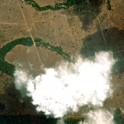

# Group_I
ADPRO Group Project

## Team

| Name               | Student Number | Email                  |
|--------------------|----------------|------------------------|
| Guilherme Morgado  | 56857          | 56857@novasbe.pt       |
| Isaac Carvalho     | 57045          | 57045@novasbe.pt       |
| Matilde Ferreira   | 56599          | 56599@novasbe.pt       |
| Miguel Teixeira    | 56529          | 56529@novasbe.pt       |

---

## Project Structure

```text
Group_I/
├── app/                   # Main application modules
│   ├── data_loader.py     # Downloads datasets (Function 1)
│   ├── data_manager.py    # OkavangoData class — orchestrates data
│   ├── image_loader.py    # Fetches satellite images from ESRI
│   ├── merger.py          # Merges geodata (Function 2)
│   ├── ollama_pipeline.py # AI analysis pipeline (vision + text)
│   └── storage.py         # Cache check before re-running pipeline
├── database/
│   └── images.csv         # History of AI analysis runs
├── downloads/             # Downloaded datasets (auto-generated)
├── images/                # Cached satellite tiles (auto-generated)
├── notebooks/             # Prototyping notebooks
├── pages/                 # Streamlit multipage app
│   ├── 2_AI_Workflow.py   # Page 2 — AI environmental risk analysis
│   └── 3_History.py       # Page 3 — Analysis history log
├── tests/                 # pytest test suite
│   ├── test_data_loader.py
│   └── test_merger.py
├── .streamlit/
│   └── config.toml        # Forced light theme for consistency
├── models.yaml            # AI model configuration (prompts, params)
├── main.py                # App entry point
└── requirements.txt
```

---

## About the Project

This tool analyses environmental data from [Our World in Data](https://ourworldindata.org) and combines it with AI-powered satellite image analysis to assess environmental risk across the globe.

The **main dashboard** (Page 1) displays interactive choropleth maps of five environmental indicators — annual change in forest area, annual deforestation, share of protected land, share of degraded land, and share of forest-covered land — alongside statistical summaries and top/bottom country rankings.

The **AI Workflow** (Page 2) allows users to select any geographical coordinates and zoom level to download a satellite image from ESRI World Imagery. The image is then analysed by a local vision model (LLaVA via Ollama) that produces a natural-language description, followed by a text model (Mistral via Ollama) that assesses whether the area is at environmental risk. Results are stored in a local CSV database, and repeated queries for the same coordinates are served from cache to save compute.

The **History** page (Page 3) displays a full log of all past analyses with filtering, sorting, a colour-coded world map, and detailed per-record views.

---

## How to Run the App

### 1. Clone the repository

```bash
git clone https://github.com/Miguel-teixeira04/Group_I.git
cd Group_I
```

### 2. Install dependencies

```bash
pip install -r requirements.txt
```

### 3. Install Ollama (required for AI Workflow)

Download and install [Ollama](https://ollama.com/) for your operating system. The app will automatically pull the required models (`llava:7b` and `mistral:7b`) on first use if they are not already available.

### 4. Launch the Streamlit app

```bash
python main.py
```

On first launch, the app will automatically download all required datasets into the `downloads/` directory. This may take a moment depending on your internet connection.

### 5. Running Tests

```bash
pytest
```

---

## Examples of Environmental Risk Detection

Below are three examples where the AI pipeline successfully identified areas at environmental risk.

### Example 1 — Amazon Deforestation (S 10.00000, W 60.00000)

**Coordinates:** S 10.00000, W 60.00000 | **Zoom:** 15 | **Result: At Risk**



The vision model described a mix of natural and human-made features, identifying cleared land with exposed soil bordering dense tropical vegetation. The risk assessment model flagged the area as **at environmental risk**, citing evidence of deforestation that can lead to soil erosion, loss of biodiversity, and contribute to climate change.

### Example 2 — Amazon Basin (S 6.00000, W 55.00000)

**Coordinates:** S 6.00000, W 55.00000 | **Zoom:** 8 | **Result: At Risk**


At a broader zoom level, the vision model identified dominant shades of green with visible patches of clearing across the landscape. The text model flagged this as **at environmental risk**, noting that deforestation is visible in multiple areas, indicating potential loss of habitat for wildlife and increased carbon emissions from forest clearing.

### Example 3 — Lake Chad Region (N 13.50000, E 14.00000)

**Coordinates:** N 13.50000, E 14.00000 | **Zoom:** 15 | **Result: At Risk**


The satellite image shows a semi-arid area mixing natural features and human-made structures. The vision model identified brown patches amidst green areas, suggesting potential land degradation. The risk assessment model flagged the area as **at environmental risk**, highlighting the contrast between arid and vegetated zones as indicative of advancing desertification and environmental stress in the Lake Chad region.

---

## UN Sustainable Development Goals

This project directly contributes to several of the [United Nations Sustainable Development Goals](https://sdgs.un.org/goals):

**SDG 15 — Life on Land.** The core of this project is monitoring terrestrial ecosystems. By tracking annual changes in forest area, deforestation rates, shares of protected and degraded land, and forest cover percentages, the tool provides a comprehensive view of the state of the world's land ecosystems. The AI satellite analysis adds a ground-truth layer — enabling users to verify whether specific areas show signs of deforestation, land degradation, or habitat loss. This directly supports Target 15.1 (conservation of terrestrial ecosystems), Target 15.2 (sustainable management of forests), and Target 15.3 (combating desertification and restoring degraded land).

**SDG 13 — Climate Action.** Forests are the planet's largest terrestrial carbon sink. Monitoring deforestation and forest area changes is critical for understanding carbon cycle disruptions. This tool makes it possible for researchers, NGOs, and policymakers to quickly identify hotspots of forest loss — areas where carbon sequestration capacity is being actively destroyed. By making this data accessible through an interactive dashboard, the project supports informed climate action and evidence-based policy decisions.

**SDG 6 — Clean Water and Sanitation.** The satellite analysis capability can detect water body changes, pollution, and watershed degradation. The Aral Sea example above illustrates how the tool can flag areas where water resources have been catastrophically depleted — information that is vital for water security planning and sustainable water management.

**SDG 14 — Life Below Water.** While the primary focus is terrestrial, coastal deforestation (such as mangrove destruction) directly impacts marine ecosystems. The satellite analysis can identify coastal areas where protective mangrove forests have been removed, increasing sedimentation and runoff that damages coral reefs and marine habitats.

In summary, this project serves as a proof-of-concept for how combining open environmental data with AI-powered satellite analysis can support evidence-based environmental monitoring at a global scale. By lowering the technical barrier to accessing and interpreting environmental data, tools like this can empower a broader range of stakeholders — from students and researchers to local authorities and international organizations — to take informed action toward sustainable development.
